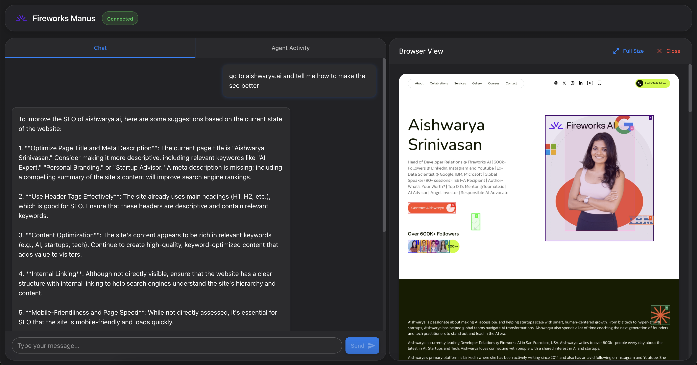
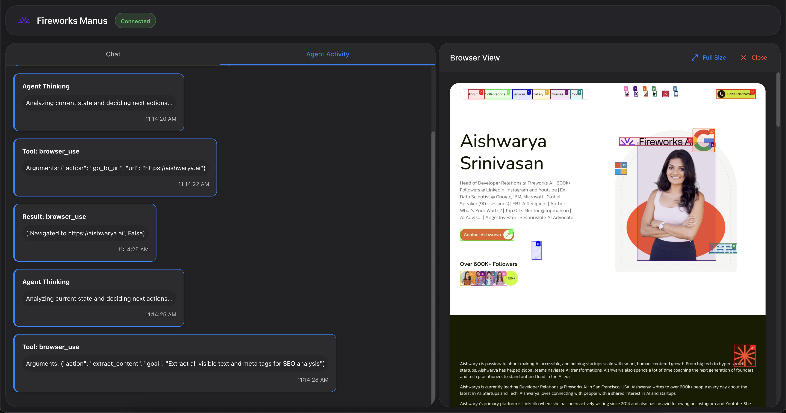

# Fireworks AI BrowserUse

A powerful AI agent for browser-based interactions powered by Fireworks AI models. This project is inspired by [OpenManus](https://github.com/mannaandpoem/OpenManus/) but leverages Fireworks AI's high-performance vision and language models for enhanced capabilities.

## Overview

Fireworks Manus is an AI agent that can navigate the web, extract content, analyze websites, and provide intelligent feedback based on what it sees. Using Fireworks AI's state-of-the-art models, it can understand web content both visually and textually, making it ideal for tasks like SEO analysis, content research, and web automation.




## Features

- **Web Navigation**: Visit any website and interact with its content
- **Content Extraction**: Analyze page text, structure, and visual elements
- **SEO Analysis**: Evaluate websites for search engine optimization opportunities
- **Interactive UI**: Simple interface for sending commands and viewing results
- **Powered by Fireworks AI**: Utilizes Fireworks' high-performance vision and language models

## Prerequisites

- Python 3.11-3.13
- Fireworks AI API key
- Modern web browser
- Unix-based OS (macOS, Linux) or WSL for Windows

## Installation

1. Clone the repository:
```bash
git clone https://github.com/shubcodes/fireworksai-browseruse.git
cd fireworksai-browseruse
```

2. Create and activate a virtual environment:
```bash
python -m venv venv
source venv/bin/activate  # On Windows: venv\Scripts\activate
```

3. Install dependencies:
```bash
pip install -r requirements.txt
```

4. Install browser automation tools (optional but recommended):
```bash
playwright install
```

## Configuration

### Setting up Fireworks AI API Keys

1. Create a copy of the example config file:
```bash
cp config/config.example.toml config/config.toml
```

2. Edit `config/config.toml` to add your Fireworks AI API keys:
```toml
# Global LLM configuration
[llm]
model = "accounts/fireworks/models/deepseek-v3"  # Or your preferred Fireworks model
base_url = "https://api.fireworks.ai/inference/v1"
api_key = "your-fireworks-api-key"  # Replace with your actual API key
max_tokens = 4096
temperature = 0.0

# Vision model configuration
[llm.vision]
model = "accounts/fireworks/models/firellava-13b"  # Fireworks vision model
base_url = "https://api.fireworks.ai/inference/v1"
api_key = "your-fireworks-api-key"  # Replace with your actual API key
```

## Starting the Application

1. Start the server:
```bash
./start_server.sh
```

2. Start the frontend (in a separate terminal):
```bash
./start_frontend.sh
```

3. Access the UI by navigating to `http://localhost:8000` in your browser

## Usage

1. **Basic Web Navigation**
   - Enter a URL to visit: `go to https://example.com`
   - Scroll down a page: `scroll down`
   - Extract content: `extract the text from this page`

2. **SEO Analysis**
   - Analyze a website's SEO: `go to https://example.com and tell me how to improve its SEO`
   - Check meta tags: `extract the meta tags from this page`
   - Suggest improvements: `how can I optimize this page for search engines?`

3. **Content Research**
   - Summarize content: `summarize the main points on this page`
   - Compare information: `go to these two websites and tell me their differences`
   - Extract specific data: `find all pricing information on this page`

## Why Fireworks Manus?

### Superior Performance

Fireworks AI models offer exceptional inference speed and quality, making Fireworks Manus significantly more responsive than alternatives. The optimized models provide:

- Faster response times for real-time analysis
- Higher quality content generation and summarization
- More accurate vision understanding and context awareness

### Cost-Effective

Fireworks AI offers high-performance models at competitive price points, allowing you to run sophisticated AI agents without excessive API costs.

### Specialized for Browser Use

Unlike general AI assistants, Fireworks Manus is specifically designed for browser-based interactions, making it ideal for:
- Website analysis
- Content research
- SEO optimization
- Web data extraction

## Architecture

Fireworks Manus consists of:

1. **Backend Server**: Python-based server that handles agent logic, API calls to Fireworks, and browser automation
2. **Frontend UI**: Web interface for interacting with the agent
3. **Browser Tool**: Integration with browser automation tools for website interaction
4. **Fireworks AI Integration**: Connections to Fireworks' language and vision models

## Troubleshooting

- **API Key Issues**: Ensure your Fireworks AI API key is correctly set in the config.toml file
- **Browser Automation**: If facing issues, try running `playwright install --with-deps` to install all required dependencies
- **Python Version**: Make sure you're using a supported Python version (3.11-3.13)
- **Port Conflicts**: If port 8000 is in use, modify the server configuration to use a different port

## Contributing

Contributions are welcome! Please feel free to submit pull requests or open issues to improve Fireworks Manus.

## License

MIT License

Copyright (c) 2025 manna_and_poem (Original OpenManus Project)

Permission is hereby granted, free of charge, to any person obtaining a copy
of this software and associated documentation files (the "Software"), to deal
in the Software without restriction, including without limitation the rights
to use, copy, modify, merge, publish, distribute, sublicense, and/or sell
copies of the Software, and to permit persons to whom the Software is
furnished to do so, subject to the following conditions:

The above copyright notice and this permission notice shall be included in all
copies or substantial portions of the Software.

THE SOFTWARE IS PROVIDED "AS IS", WITHOUT WARRANTY OF ANY KIND, EXPRESS OR
IMPLIED, INCLUDING BUT NOT LIMITED TO THE WARRANTIES OF MERCHANTABILITY,
FITNESS FOR A PARTICULAR PURPOSE AND NONINFRINGEMENT. IN NO EVENT SHALL THE
AUTHORS OR COPYRIGHT HOLDERS BE LIABLE FOR ANY CLAIM, DAMAGES OR OTHER
LIABILITY, WHETHER IN AN ACTION OF CONTRACT, TORT OR OTHERWISE, ARISING FROM,
OUT OF OR IN CONNECTION WITH THE SOFTWARE OR THE USE OR OTHER DEALINGS IN THE
SOFTWARE.

---

*Fireworks Manus is not affiliated with Fireworks AI or OpenManus. It is an independent project leveraging these technologies.*
